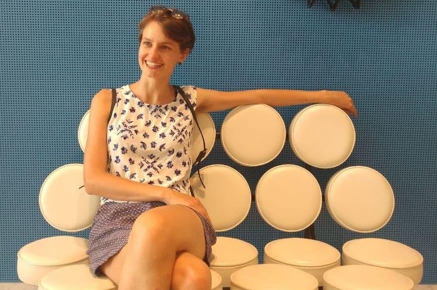

I'm a PhD student in computational biology in the Cellular Genetics programme at the Wellcome Sanger Institute and the University of Cambridge, working between the groups of [Sarah Teichmann](http://www.teichlab.org/) and [John Marioni](https://www.ebi.ac.uk/research/marioni). 

I'm interested in comparative analyses between single-cell datasets, modelling cell development across time, asynchrony between molecular modalities. 

I like reusable code, reproducible analyses, dank memes and slow movies.

--- 

<h3>Contact</h3>

    

        

            Emma Dann 
            <a href="https://www.sanger.ac.uk/programme/cellular-genetics/">Cellular Genetics programme</a> 
            <a href="https://www.sanger.ac.uk">Wellcome Sanger Institute</a> 
            Wellcome Genome Campus, Saffron Walden CB10 1SA 
            Cambridge, United Kingdom   

            

        <code>ed6@sanger.ac.uk</code> 
        <a href="https://github.com/emdann">&nbsp; github: emdann</a> 
        <a href="https://twitter.com/emmamarydann">&nbsp; @emmamarydann</a>  
            

        

        
        

            
        

    

