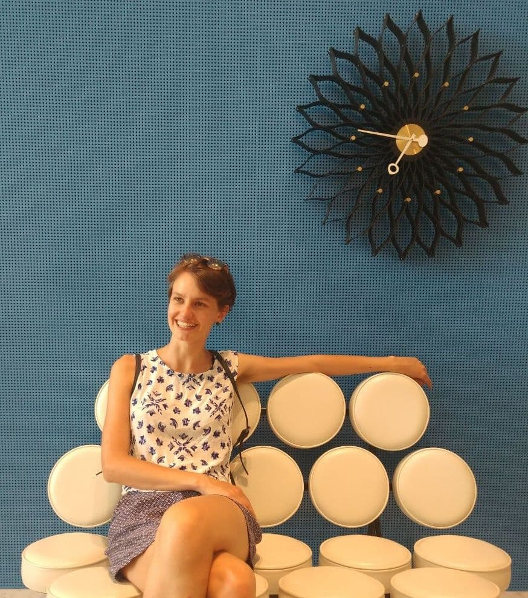

I work on computational and statistical methods to model multi-modal genomics data. I am excited about how innovative tech continously adds new biological dimensions to explore.   

I am currently a PhD student in the Cellular Genetics programme at the Wellcome Sanger Institute and the University of Cambridge, working between the groups of [Sarah Teichmann](http://www.teichlab.org/) and [John Marioni](https://www.ebi.ac.uk/research/marioni). My main projects revolve around modelling the kinetics of gene regulation during human development, analyzing chromatin accessibility and gene expression profiles in single-cells. 
<-- I am studying gene regulation in fetal development of human lymphoid organs. -->

I'm all for writing reusable code and reproducible analyses.

--- 

<h3>Contact</h3>

    

        

            Emma Dann 
            <a href="https://www.sanger.ac.uk/programme/cellular-genetics/">Cellular Genetics programme</a> 
            <a href="https://www.sanger.ac.uk">Wellcome Sanger Institute</a> 
            Wellcome Genome Campus, Saffron Walden CB10 1SA 
            Cambridge, United Kingdom   

            

        <code>ed6@sanger.ac.uk</code> 
        <a href="https://github.com/emdann">&nbsp; github: emdann</a> 
        <a href="https://twitter.com/emmamarydann">&nbsp; @emmamarydann</a>  
        

img.resize {
  max-width:50%;
  max-height:50%;
}
        

            
        

    

